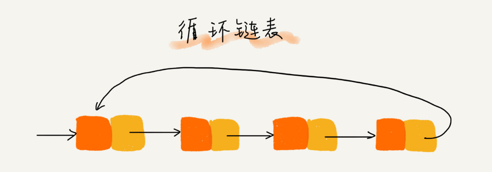
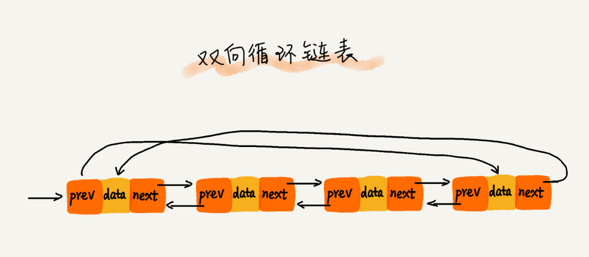

# 如何用链表来实现 LRU 缓存淘汰策略呢？
> 常见 CPU缓存、数据库缓存。 缓存的大小有限，当缓存被用满时，哪些数据应该被清理出去，哪些数据应该被保留？这就需要缓存淘汰策略来决定。常见的策略有三种：先进先出策略 FIFO（First In，First Out）、最少使用策略 LFU（Least Frequently Used）、最近最少使用策略 LRU（Least Recently Used）。

#### 数组：连续的内存空间，对内存要求高。
#### 链表：零散的内存块

## 单链表


#### 单链表的结点只包含数据和后继指针
#### 头结点：记录链表的基地址
#### 尾结点：指针指向空地址NULL

### 插入与删除
> 数组：为了保证内存的连续性，数组插入与删除需要搬移数据，时复为O（n）
>
> 链表：本身就是零散的内存空间串在一起，链表插入与删除不用搬移数据，只是改变结点的后继指针，时复为O（1）

### 查找
> 数组：内存的连续性保证了根据下标随机访问数据的时复为O（1）
>
> 链表：只知道链表的基地址，要查找第k个数据就需要从头结点开始遍历，时复为O（n）

## 循环链表


#### 尾结点的next指针指向头结点，具有环形结构

## 双向链表


#### 每个结点都有一个prev前驱指针和一个next后继指针
#### 因为多了前驱指针，会占更多的内存。但支持双向遍历，链表操作更灵活

### 删除
1. 删除结点中“值等于给定值”的结点
> 无论是单链表还是双向链表，此种删除操作都需要先遍历链表（时复O（n）），然后删除找到的结点（时复O（1））。根据时复的加法法则，删除操作的时复为O（n）。

2. 删除给定指针指向的结点（已知要删除的结点）
> 单链表：删除结点q需要之前它的前驱结点，但单链表不能直接获取前驱结点，需要遍历链表找到前驱结点才能进行删除操作，p -> next = q , 说明p是q的前驱结点。时复为O（n）。
>
> 双向链表： 支持直接获取前驱结点。时复为O（1）

### 使用了空间换时间的思想，Java的LinkedHashMap使用了双向链表

## 双向循环链表


## 链表 VS 数组

时复 | 数组 |  链表
--|--|--
插入/删除| O（n）| O（1）
随机访问 | O（1）| O（n）

> 数组和链表的选择，不能仅限于时间复杂度的对比，根据实际情况而定

> 1. 数组简单易用，使用的是连续的内存空间，可以借助CPU的缓存机制，预读数组中的数据，访问效率更高。 链表使用的是零散的内存空间，对CPU缓存不友好。
    > * CPU缓存是为了弥补内存访问速度过慢而CPU执行速度过快的差异而引入的。CPU在从内存读取数据时，会把读取到的数据加载到缓存中。而CPU从内存中读取的并不只是特定地址的数据，而是读取一个小数据块，并保存在缓存中。在CPU下次访问内存数据时，会先从缓存中查找，若没找到再去查找内存，若找到了就不用去访问内存了，这样就实现了比内存访问更快的缓存机制。
    > * 数组利用的是连续缓存，所以CPU在从内存中读取特定地址的数据时，可以顺便读取之后连续的一小块内存加载到缓存中，这样会比加载存储在链表中的数据快些。 所以说链表对CPU缓存不友好。
> 2. 数组的缺点是大小固定，需要提前申请一定大小的内存空间。若申请size过大，浪费内存或导致“内存不足”（error）；若size过小，当空间已满后需要动态扩容，涉及内存申请和数据搬移，耗时。 而链表本身没有大小限制，天然支持动态扩容。
> 3. 对内存十分敏感的更适合使用数组。链表需要存储指针，内存消耗会翻倍。且对链表频繁的插入与删除，会导致频繁地申请与释放内存，产生内存碎片。

## 使用链表设计LRU缓存淘汰算法

维护一个单链表，越接近链表尾部，是越早之前访问的数据。

插入数据：
1. 若数据存在于链表中， 则遍历链表找到数据所在结点，删除此结点，并将此结点添加到链表头部；
2. 若数据不存在链表中
    - 缓存未满，则直接生成该数据结点，并添加到链表头部。
    - 缓存已满，删除尾结点，并将该数据结点添加到链表头部。

基于链表的缓存访问都需要遍历数据，故时复为O（n）

优化方案：引入散列表（Hash Table）来记录数据的存放位置，将缓存访问将为O（1）

## 如何轻松写出正确的链表代码？
1. 理解指针或引用的含义
> C 或 C++中含有指针，Python 和 Java 有引用。 指针和引用的含义都是存储所指对象的内存地址。
>
> 对于指针的理解： 将变量赋值给指针，实际上是把变量的内存地址存储在指针中。指针指向这个变量，通过存储的内存地址便找到了这个变量。

2. 警惕指针丢失和内存泄漏
> 在进行链表操作时，要注意当前指针指向哪个结点，该结点的前驱或者后继结点是什么。 对于C语言来说，删除结点需要释放内存，否则会造成内存泄漏。
```
    // 在 a、b结点之间插入x结点，当前指针p指向a结点
    p -> next = x;  // a结点指向x
    x -> next = p -> next; // x 应该指向b， 但此时p -> next 不等于b
```
> 以上代码造成指针丢失， 正确写法是交换两行代码。

3. 利用哨兵简化实现难度

```
// 在结点p后插入新结点
// 头结点
if(head == null)
    head -> next = new_node

new_node -> next = p -> next
p -> next = new_node
```

```
// 删除p结点的后继结点
// 链表中只有一个结点
if(head -> next == null)
    head == null

p -> next = p -> next -> next
```
> 对于链表的插入和删除操作，需要对头尾结点做特殊处理，使得代码繁琐。对此，我们可以引入哨兵进行代码简化。将哨兵放在头部，head指针指向哨兵结点，这叫带头链表。反之，不带哨兵结点的叫做不带头链表。

4. 重点留意边界条件的处理
> 如果链表为空
> 链表只包含一个结点
> 链表只包含两个结点
> 对于头尾结点的逻辑处理，是否正确

5. 举例画图，辅助思考
6. 多写多练，没有捷径


## 思考
1. 若字符串存储在链表中，如何判断是否是回文字符串？
> 通过快慢指针找到链表的中间结点，然后反转后半段链表，再与前半段链表依次进行比较

2. 常见链表操作：
    * 单链表反转(迭代&递归)
    * 链表中环的检测 （哈希表）
    * 两个有序的链表合并 
    * 删除链表倒数第 n 个结点（一次遍历使用快慢指针）
    * 求链表的中间结点（快慢指针）
