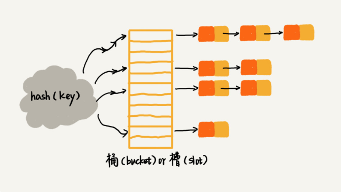

# Hash Table (哈希表 或 散列表)

## 散列思想
> 散列表用的是数组支持按下标随机访问数据的特性。所以说散列表是数组的一种扩展，由数组演化而来。

> 通过散列函数将关键字key映射为下标， 存储到数组对应下标的位置。 当按照键值查询数据时，用散列函数将键值映射为下标，到下标对应的内存位置取数据

--- 
## 散列函数

构造散列函数的基本要求

1. 散列函数计算得到的散列值是一个非负整数
    > 数组下标从0开始
2. 如果key1 == key2， 则hash(key1) == hash(key2)
    > 同一个键值通过散列函数求出的散列值相同
3. 如果key1 != key2， 则hash(key1) != hash(key2)
    > 实际情况中，很难找到一个不同的value，计算出的散列值都不一样的散列函数。即便像业界著名的MD5、SHA、CRC等哈希算法，也无法完全避免这种*散列冲突*

---
## 解决散列冲突问题
### 1. 开放寻址法 （open addressing）
> 核心： 如果出现散列冲突，重新探测一个空闲位置

> 1. 线性探测（linear probing）
> 
>       向散列表 *插入* 数据时，当计算出的散列值对应的数组位置已被占用，将从该位置依次向后探测，直到找到一个空闲位置为止，插入数据。
> 
>       从散列表中 *查找* 数据时，计算出查找元素对应的散列值，然后比较数组下标为散列值的元素和查找元素，若相等，则说明就是我们要找的元素；否则顺序往后依次查找进行比较。如果遍历到数组的空闲位置，还没找到，就说明要查找的元素不在散列表中。
>
>       从散列表 *删除* 数据时，不能简单地将对应下标位置设为空。 因为查找元素遍历到空闲位置时说明元素不存在散列表中。删除数据直接置空会使之前的散列算法失效。我们可以将删除的元素，特殊标记为deleted。当查找线性探测时，遇到deleted继续往下探测。
> 
>       当散列表中插入的数据越多，发生散列冲突的概率越大，空闲位置越少，线性探测的时间会越久。极端情况下会遍历整个数组，最坏时复为O（n）

> 2. 二次探测（Quadratic probing）
>       
>       所谓二次探测，跟线性探测很像，线性探测每次探测的步长是 1，那它探测的下标序列就是 hash(key)+0，hash(key)+1，hash(key)+2……而二次探测探测的步长就变成了原来的“二次方”，也就是说，它探测的下标序列就是 hash(key)+0，hash(key)+1^2，hash(key)+2^2……

> 3. 双重散列（Double hashing）
>
>       所谓双重散列，意思就是不仅要使用一个散列函数。我们使用一组散列函数 hash1(key)，hash2(key)，hash3(key)……我们先用第一个散列函数，如果计算得到的存储位置已经被占用，再用第二个散列函数，依次类推，直到找到空闲的存储位置。

> 不管采用哪种探测方法，当散列表中空闲位置不多的时候，散列冲突的概率就会大大提高。为了尽可能保证散列表的操作效率，一般情况下，我们会尽可能保证散列表中有一定比例的空闲槽位。我们用装载因子（load factor）来表示空位的多少。

```
    散列表的装载因子=填入表中的元素个数/散列表的长度
```
> 装载因子越大，说明空闲位置越少，冲突越多，散列表的性能会下降。
 
### 2. 链表法 （chaining）



> 当插入的时候，我们只需要通过散列函数计算出对应的散列槽位，将其插入到对应链表中即可，所以插入的时间复杂度是 O(1)
>
> 查找和删除的时复取决于对应链表的长度K。 对于散列比较均匀的散列表来说， k = n / m (n为散列表所有数据的个数， m为槽的个数)

---
## 思考
### 1. word文档中单词拼写检查功能是如何实现的？
> 常用英文单词大概有20万个，假设平均每个单词有10个字母，存储一个单词需要10字节，20万单词大概占用2MB的存储空间，放大10倍也才20MB，对现在的计算机来说，完全可以将这20MB的单词放在内存中。可以用散列表来存储所有英文单词。
>
> 用户使用word文档输入单词后， 根据输入的单词去散列表中查找，没找到则给与用户提示。利用散列表可以快速判断单词拼写是否拼写错误。

### 2. 假设我们有 10 万条 URL 访问日志，如何按照访问次数给 URL 排序？
> 10万条字符串大约10MB，可以使用散列表存储。遍历访问日志，将URL做key， 对应的访问次数做value，存储在散列表中。 然后根据访问次数的范围选择合适的排序算法。

### 3. 有两个字符串数组，每个数组大约有 10 万条字符串，如何快速找出两个数组中相同的字符串？
> 以第一个字符串数组构建散列表，字符串为key，出现次数为value。遍历第二个数组，以字符串为key查找散列表，存在则说明有相同字符串。时间复杂度为O（n）
