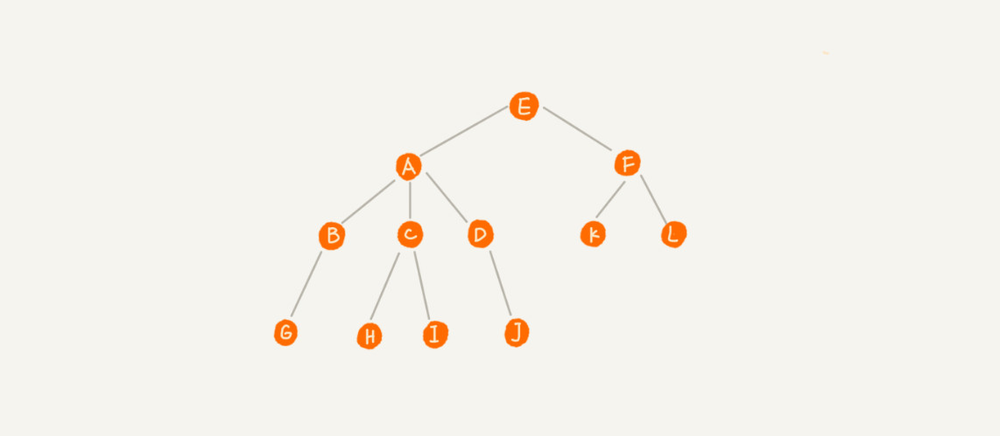

# 树

- 根节点： 没有父节点的节点，E
- 父节点： A是B的父节点
- 子节点： B是A的子节点
- 兄弟节点： B、C、D是兄弟节点
- 叶子节点： 没有子节点的节点，G、H、I、J、K、L

- 节点的高度：节点到叶子节点的最长路径（边数）
- 节点的深度：根节点到这个节点的路径（边数）
- 节点的层数：节点的深度 + 1
- 树的高度： 根节点的高度

## 二叉树（Binary Tree）

每个节点最多只有左右两个子节点。

- 满二叉树：最后一层全是叶子节点，除去最后一层的叶子节点，其余每个节点都有左右两个子节点
- 完全二叉树： 最后一层叶子节点的都从左边开始排序，除去最后一层就是满二叉树。

## 二叉树的存储
1. 基于指针或引用的二叉链式存储法
    
    每个结点含有3个属性，data表示存储对象数据，left和right指针分别表示左右子节点。

2. 基于数组的顺序存储法

    把根节点存放在下标i=1的位置，则它的左子节点的下标为i = 2 * 1 = 2，它的右子节点的下标为i = 2 * 1 + 1 = 3，所有节点X的存放位置下标为i，则它的左子节点存放在2i，右子节点存放在2i+1

若是一棵完全二叉树，采用数组存储只会浪费下标为0的内存空间。若是一颗普通的树，会浪费数组的多个内存空间。

所以对于完全二叉树，顺序存储是最省内存的方式，因为不需要像链表存储额外的左右子节点的指针，这是完全二叉树要求最后一层子节点靠左的原因。

## 二叉树的遍历

按层遍历：借助队列，按层依次入队， 遍历下一层节点时，先出队拿到节点，再入队该结点存在的左右子节点

## 二叉查找树（Binary Search Tree）

> 任意一个节点，其左子树中每个节点的值都小于该节点的值，其右子树中每个节点的值都大于该节点的值

### 查找
### 插入
### 删除
1. 查找要删除的节点p和它的父节点pp
2. 要删除的节点p含有两个子节点：
    - 找到节点p的右子树的最小节点minP和它的父节点minPP
    - 将节点p的值换成minP的值
    - 删除节点minP（相当于删除叶子节点或只有一个右子节点的节点）

3. 要删除的节点p含有0或1个子节点：
    - 获取节点p的孩子节点
    - 将父节点pp的子节点修改为孩子节点，需判断子节点的左右和p是否是根节点

或者直接将要删除的节点标记为“已删除”，这样会浪费内存空间，但删除操作简单，且对查找和插入操作也不影响。

### 支持快速查找最大、最小、前驱、后继节点

### 支出重复数据的查找
1. 在同一个节点上利用数组或链表存放相同的数据
2. 把相同的值当作大于节点来看，插入到树结构中。 查找时，遇到值相同的节点记录下来继续查找，直到查到叶子节点为止。删除时，需要先查找所有值相同的节点再进行删除操作。

## 二叉查找树的时间复杂度分析
- 时间复杂度跟树的高度成正比， O（height）
- 每层（高度为h， 层数为i）的最大节点数为 2^h 或 2^(i-1)
- 完全二叉树最后一层的节点数范围[1, 2^(i-1)]
- 若有n个节点，则树的高度为

最差情况，二叉树的所有节点都只有左子节点或者只有右子节点，二叉查找树退化成链表，查找、插入与删除时复为O（n）。
理想情况，二叉查找树是一棵完全二叉树