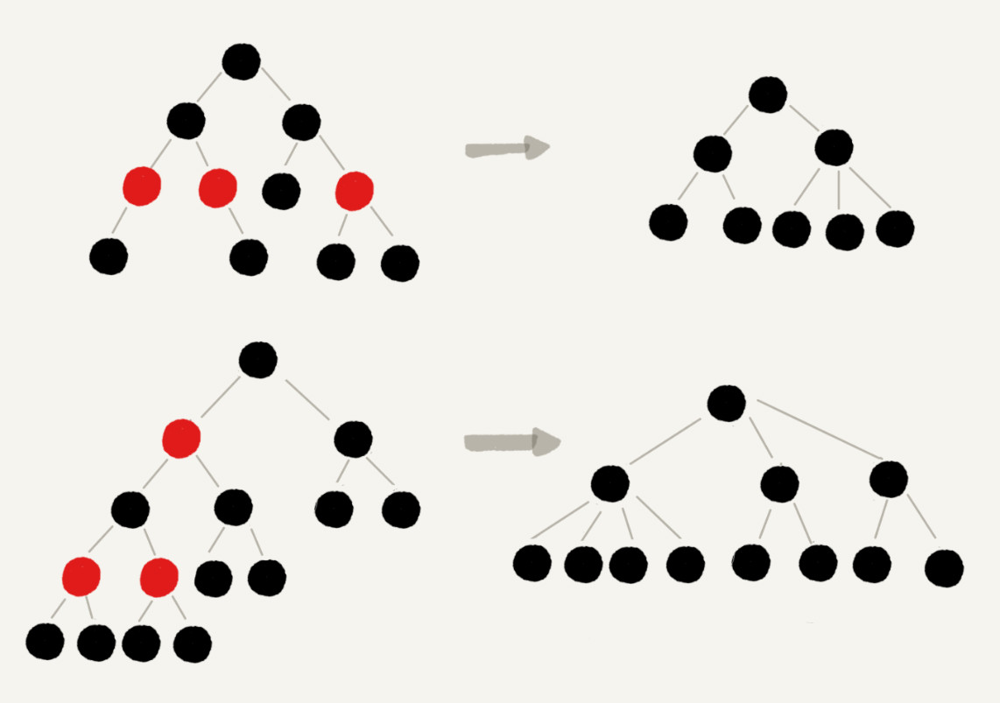

# 红黑树

> 二叉查找树在频繁地动态更新过程中，可能会出现树的高度远大于log2 N 的情况，从而导致各个操作的执行效率下降。极端情况下，二叉树会退化成链表，时复退化到O(n)。故要解决复杂度退化的问题，设计出了平衡二叉查找树。

> 平衡二叉查找树中使用最多的就是红黑树。

## 平衡二叉查找树
平衡二叉树的严格定义：二叉树中任意一个节点的左右子树的高度相差不能超过1.

最先发明的平衡二叉查找树是AVL树，它严格符合平衡二叉树的定义，是一种高度平衡的二叉查找树。

很多平衡二叉查找树并没有严格符合平衡二叉树的定义，比如红黑树，它从根节点到各个叶子节点的最长路径，可能比最短路径大一倍。

## 红黑树的定义
红黑树的节点被标记为红色或者黑色：
1. 根节点是黑色
2. 每个叶子节点都是黑色的空节点（Null），即叶子节点不存储数据（为了简化红黑树的代码实现而设置）
3. 任何相邻的节点都不能同时为红色，即红色节点是被黑色节点隔开的
4. 任一节点到达其可达叶子节点的所有路径，都包含相同数目的黑色节点

## 为什么说红黑树是“近似平衡”的
平衡二叉查找树是为了使二叉查找树的性能不退化，故“近似平衡”等价于性能不能退化的太严重

一棵极其平衡的二叉查找树的高度大约为log2 N，所以要证明红黑树是近似平衡的，只需要分析红黑树的高度是否稳定地趋近于log2 N。

1. 将红黑树中的红色节点去掉后，部分失去父节点的节点将以原来的祖父节点作为新的父节点，之前的二叉树就变成了四叉树。

从四叉树中取出部分节点，放到叶子节点的位置，那么就变成了完全二叉树。 所以仅包含黑色节点的四叉树的高度比包含相同节点个数的完全二叉树的高度小。 而完全二叉树的高度近似log2 N，所以去掉红色节点的“黑树”的高度也不会超过log2 N。

2. 在红黑树中，红色节点不能相邻，也就是有一个红色节点就至少有一个黑色节点将其与其他红色节点隔开。红黑树中包含最多黑色节点的路径不会超过log2 N，所以加入红色节点后，最长路径不超过2log2 N。 故红黑树的高度近似2log2 N。

红黑树比高度平衡的AVL树的高度大了一倍，但性能上红黑树更好。AVL树要维护高度平衡要付出很大代价，而红黑树只是近似平衡，所以维护代价相对较低。

## 动态数据结构对比

散列表：借助数组实现查找操作时复为O（1），会发生散列冲突，用开放寻址或者链表法来解决。

跳表：在链表上加入多级索引，查找时复为O（logn）

红黑树：一种平衡二叉查找树，时复为O（logn）

