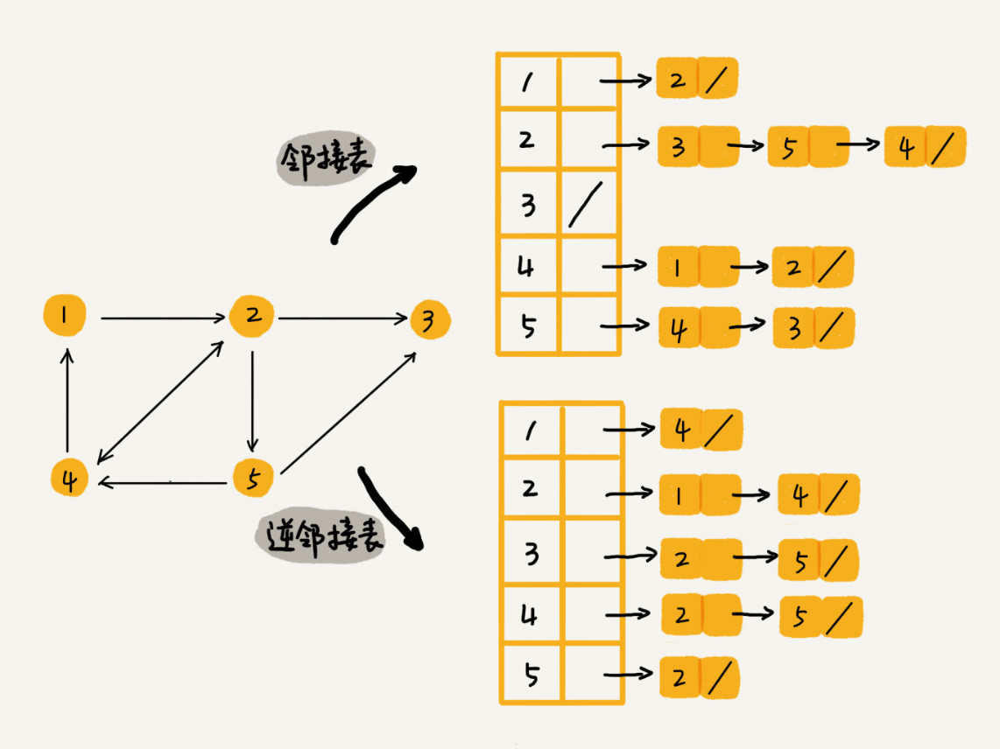

# 图
顶点（vertex） 边（edge） 度（degree）
有向图： 入度（in-degree） 出度（out-degree）
带权图（weighted graph）

## 图的存储
### 邻接矩阵（Adjacency Matrix）

使用邻接矩阵存储图，简单直观，但比较浪费内存空间。如：无向图中邻接矩阵是对角线上下对称的，稀疏图中边很少，对应的邻接矩阵很多位置都是0。邻接矩阵的优点是基于数组可以快速查看两顶点中是否有边。

### 邻接表（Adjacency List）

针对邻接矩阵浪费内存的问题，设计了邻接表存储图。结构与散列表+拉链相似。对于无向图来说，每个顶点后面的链表存放的就是与该顶点之间有边的所有顶点。

若要查看某两个顶点A与B之间是否有关系，则要在A顶点的链表中查找是否有B，若是单链表的结构，查找时复为O（n），查找速度太慢，可以将单链表改进为高效的动态数据结构，如跳表、散列表、平衡二叉查找树等，或是改成有序数组使用二分查找。

邻接矩阵费内存，查找速度快，属于空间换时间；邻接表省内存，查找速度较慢，属于时间换空间。

## 如何存储微博中的好友关系？
1. 判断A是否关注了B
2. 判断B是否是A的粉丝（A被B关注）
3. 用户A关注B
4. 用户A取消关注B
5. 根据用户名称的首字母排序，分页获取A的关注列表
6. 根据用户名称的首字母排序，分页获取A的粉丝列表

根据需求可知好友关系是一个有向图，出度即为关注，入度即为粉丝，采用邻接表省空间，要维护关注用户对应的邻接表和粉丝用户对应的逆邻接表。因为用户众多，单靠邻接表很容易查找关注用户，但查找粉丝用户则很困难，故额外再维护一个逆邻接表。

基础的邻接表不适合快速判断两个用户之间是否有关注与被关注关系，所以将邻接表中的链表改进为支持快速查找的动态数据结构。要按用户名称首字母排序分页获取关注与粉丝列表，这里采用跳表最合适，因为跳表是已排序的，查找插入与删除都很高效，时复为O（logn），要存储索引，空复为O（n）。

对于小规模数据，如几万、几十万用户数据，可以直接用跳表存放在内存中。但对于微博上亿用户的大规模数据，内存是不够的。

1. 通过哈希算法等数据分片方式，将邻接表存放在多台机器上，例如将顶点1,2,3的邻接表和逆邻接表存放在机器1上，将顶点4,5的邻接表和逆邻接表存放在机器2上。当要查询顶点间的关系时，先利用哈希算法定位到机器上，再查找邻接表。

2. 利用外部存储（硬盘等，存储空间非常大），数据库的持久化存储方式。建表存放user_id与follow_id。

## 广度优先搜索（bfs）与深度优先搜索（dfs）

两者都需要使用visited数组记录已访问的顶点，使用prev数组记录访问路径

bfs借助队列对图进行按层遍历（记录层数可以应用于寻找n度好友）

dfs借助栈使用递归缩短搜索路径（设置递归的深度同样可以寻找n度好友），同时需要一个布尔变量found来结束递归函数。

都需要对所有顶点和边进行遍历，连通图中边数E>=顶点数V-1，bfs和dfs的时复为O（E+V），也可以写成O（E）

借助了额外的内存空间visited、队列或栈，否不超过顶点总数V，故空复为O（V）

## 如何将迷宫抽象成一个图？即计算机如何存储迷宫？
设置迷宫的入口和出口为开始顶点s和结束顶点t，从入口开始随机选一条路走，每走到分叉口建立一个顶点，且与上一个顶点建立一条边，给边加上权重用来记录两点间的距离，走到死胡同就进行回溯。最后利用bfs或dfs可以找到s到t的唯一一条路径。