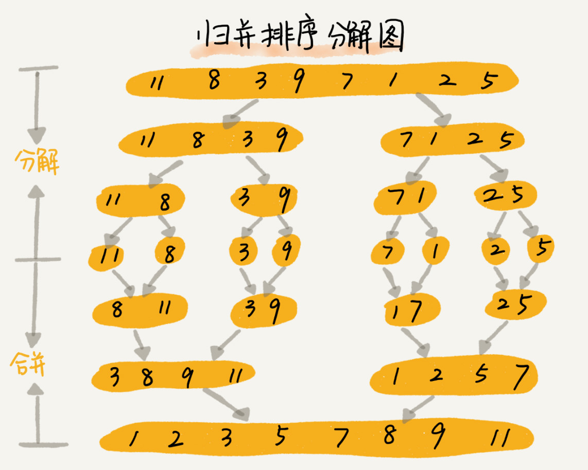

# 归并排序 & 快速排序  O（nlogn）

## 归并排序（merge sort）
> 归并排序采用分治思想，将整个数组从中间分成前后两部分，分别排好序后再合并到一起排序。

> 分治是一种解决问题的处理思想，递归是一种编程技巧

1. 是稳定的排序
> merge函数中，值相同的元素在合并后没有改变先后顺序
2. 时间复杂度
> 把数组两两分开的时复是logN，合并过程中要遍历数组时复是N，两者属于嵌套关系，故归并排序的时复为O（NlogN）
>
> 归并排序的执行效率与原始数组的有序度无关，最好、最坏、平均时复都相同。
3. 不是原地排序
> 在合并函数中，需要借助一个额外空间来存临时数组，每次使用完临时数组后就释放掉占用的空间，且每次只会有一个合并函数在执行，所以空间复杂度是O（n）

## 快速排序
> 快排思想：选取一个元素作为pivot（分区点， 一般选择最后一个元素），将小于pivot的元素放左边，大于pivot的元素放右边，使用递归方式进行分区，直至区间缩小为1

1. 不是稳定的排序
> 在分区函数中存在元素交换位置，因此会改变相同元素的先后顺序
2. 是原地排序
3. 时间复杂度
> 分区函数的时复是O（n）
> 最好情况：每次pivot都是中位数，数组分割次数LogN，故时复O(nlogn)
> 最坏情况：已排好序的数组，需要分割n次，O(n^2)
> 大部分情况下快排的时复都是O(nlogn)，极端情况才会退化到O(n^2)

## 归并与快排的区别

> 归并排序的处理是自下而上的，先处理子问题，合并排序后，再处理父问题。
>
> 快速排序的处理是自上而下的，先分区排序，再处理子问题。
>
> 归并排序是稳定排序，但空复为O（n），这是致命缺点。 所以相比较，快速排序更受欢迎。
快排在大部分情况下时复为O(nlogn)，极端情况才会退化到O(n^2)，且极端情况发生的概率很小，并且我们可以选择合适的pivot来避免极端情况的发生。

## 如何在O（n）时间复杂度内查找无序数组的第K大元素（从小到大排序后的第k个元素）？

采用快排分区的思想，选取pivot分区，分区点为p，
若k = p+1, pivot就是第k大元素
 k > p+1, 继续在[p+1, r]中查找
 k < p+1, 继续在[l, p-1]中查找

 这样，遍历的次数分别是n、n/2、n/4、n/8 ... 直到区间缩小为1
 所以总的遍历次数为（n + n/2 + n/4 + n/8 + ... + 1）= 2n - 1, 故时复为O（n）

 ## 现在你有 10 个接口访问日志文件，每个日志文件大小约 300MB，每个文件里的日志都是按照时间戳从小到大排序的。你希望将这 10 个较小的日志文件，合并为 1 个日志文件，合并之后的日志仍然按照时间戳从小到大排列。如果处理上述排序任务的机器内存只有 1GB，你有什么好的解决思路，能“快速”地将这 10 个日志文件合并吗？

 利用上1GB的内存，且每个文件中的日志是排好序的，可以采用归并排序的方法，
 每次分别从10个文件中取一批数据进行归并排序，将排序结果写入新的日志文件中，释放空闲内存，再重复读取与归并排序操作。