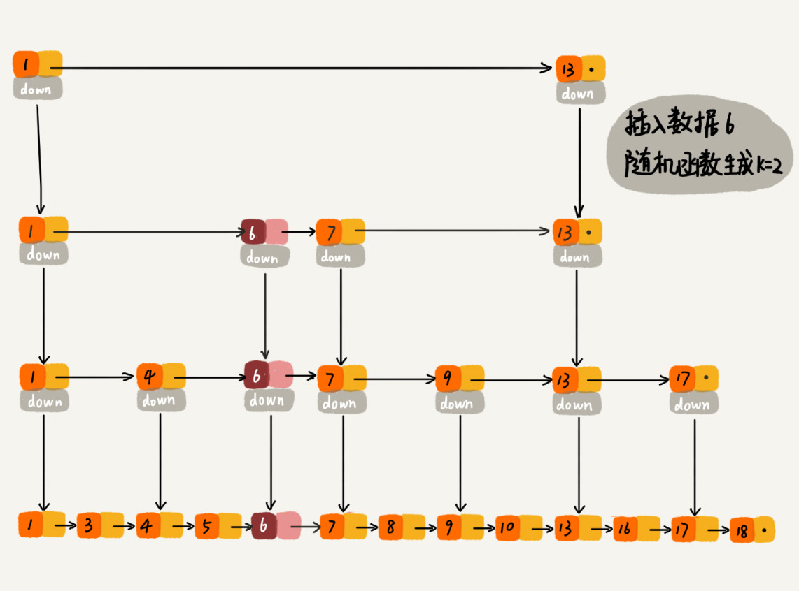

# 跳表
> 对链表加以改造，便可支持类似“二分”的查找算法，改造后的数据结构就叫做“跳表”
> 跳表支持快速插入、删除、查找操作，是一种性能较高的动态数据结构

## 理解
即使对于有序链表，查找某个数，也需要遍历，时复为O（n）。如何提高查找效率呢？建立索引。。

> 建立一级索引，每两个结点提取一个，图中down表示down指针。

> 在一级索引的基础上，加二级索引

## 用跳表查询到底有多快？
设链表有n个结点，一级索引有n/2个结点，第k级索引的结点个数为n/(2^k)

设每两个结点提取，链表共有h级索引，第h级索引有2个结点（3个结点的情况可以当做2个），则 n/(2^h) = 2，h = log2 N - 1 ，加上原始链表，整个跳表的高度是h+1 = log2 N， 若每次遍历m个结点，则时间复杂度是O（m*logn）。

当查找元素为x， 查找第k级索引，发现 y < x < z ,则查找第k-1级索引，要查找y，&，z共三个结点，判断x处于（y，&）还是（&，z）之间，所以每层遍历最多3个结点。故跳表查找操作的时复为O（logn）。

查询效率提升的前提是建立索引，用了空间换时间的思想。

## 跳表要消耗额外的内存空间
跳表建立索引的结点总数为 n/2 + n/4 + ... 8 + 4 + 2 = n - 2， 故跳表的空复为O（n)。
也就是说n个结点的单链表构造成的跳表，需要接近n个结点的额外的内存空间。

* 如何才能减少消耗的内存空间呢？
索引的建立换成每3个结点提取一次，总的索引结点数为n/3 + n/9 + ... + 9 + 3 = n/2， 空复还是O（n），但索引结点数减少了大约一半。

实际开发中，链表存放的不是简单的数字，有可能是很大的对象，这时索引结点占用的空间相对于对象结点来说是可以忽略不计的。

## 高效的动态插入与删除

在单链表中，要插入与删除结点，需要遍历链表，插入与删除操作的时复为O（1），所以总的时复为O（n）

而跳表中查找某个结点的时复O（logn），所以跳表的动态插入与删除操作时复均为O（logn）

## 跳表索引动态更新

若不断地在某两个结点之间插入结点，会造成对应索引结点之间的结点越来越多，使得这一段表现为单链表。所以极端情况下，跳表就退化为单链表了。

为了维护索引与原始链表之间的大小平衡，在往跳表中插入数据时，可以同时往部分索引层中插入该数据。通过随机函数，来决定新的数据插入到哪几级索引中

关于随机函数的选择可以看Redis 中关于有序集合的跳表实现。

